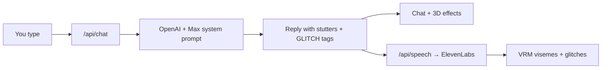

# Max Headroom

Chat with an animated 3D Max Headroom — the snarky 1980s TV host with digital stutters, glitch effects, wireframe set, and cloned voice support.

Built by [AtariDHD](https://github.com/AtariDHD).

  

## Features

- **3D VRM avatar** — purchased Max Headroom model with viseme lip sync (`aa`, `ih`, `ou`, `ee`, `oh`)
- **Wireframe cube set** — green / yellow / pink grid corner background (classic TV look)
- **Chat** — OpenAI-powered Max personality with stutters and `[GLITCH]` markers
- **Voice** — ElevenLabs instant voice clone when configured; browser TTS fallback
- **Mannerisms** — head tilt, stutter jerks, scanlines, bloom, chromatic glitch bursts
- **Demo mode** — works without API keys (canned replies + browser voice)

## Quick start

```bash
git clone https://github.com/AtariDHD/max-headroom.git
cd max-headroom
npm install
cp .env.example .env
```

1. Add your **VRM model** to `assets/` (see [assets/README.md](assets/README.md))
2. Edit `.env` with your API keys (optional but recommended)
3. Run:

```bash
npm start
```

Open **http://localhost:3000**

> **Note:** Restart the server after changing `.env`. Hard-refresh the browser (Ctrl+Shift+R) after updates.

## Configuration

Copy `.env.example` to `.env`:

| Variable | Required | Purpose |
|----------|----------|---------|
| `OPENAI_API_KEY` | For AI chat | Powers Max's personality via GPT-4o-mini |
| `ELEVENLABS_API_KEY` | For HD voice | ElevenLabs TTS API key |
| `ELEVENLABS_VOICE_ID` | For HD voice | Voice ID from your ElevenLabs library or clone |
| `PORT` | No | Server port (default `3000`) |

### OpenAI

1. Create an API key at [platform.openai.com](https://platform.openai.com/api-keys)
2. Add billing / credits — free ChatGPT accounts do **not** include unlimited API quota
3. If you see *"Max hit a network glitch"*, check the server console; `429 insufficient_quota` means you need API credits

### ElevenLabs (recommended voice)

1. Create an account at [ElevenLabs](https://elevenlabs.io)
2. Use **Instant Voice Clone** or pick a fast, sharp male voice
3. Copy the **Voice ID** into `ELEVENLABS_VOICE_ID`
4. Click once on the page if greeting audio is silent (browser autoplay policy)

Status pill meanings:

- `DEMO CHAT` — no OpenAI key loaded
- `HD VOICE` — ElevenLabs configured
- `BROWSER VOICE` — using browser speech synthesis

## 3D model setup

The purchased Max Headroom VRM is **not included** in this repo (licensing). Place your files in `assets/`:

```
assets/
  MaxHeadRoom.vrm    ← required (rename or update path in max-head.js)
  textures/          ← optional if embedded in VRM
```

See [assets/README.md](assets/README.md) for details.

## How it works



## Project layout

```
assets/              3D model files (local only, not in git)
public/
  js/max-head.js     VRM loader + viseme lip sync
  js/max-scene.js    Three.js scene, lighting, post-processing
  js/cube-corner.js  Wireframe grid corner background
  js/max-voice.js    Speech playback + mouth analysis
  js/max-effects.js  Glitch coordination
  js/main.js         App wiring
scripts/             Dev utilities (VRM inspection)
server.js            Express API (chat + TTS)
```

## Scripts

| Command | Description |
|---------|-------------|
| `npm start` | Start production server on port 3000 |
| `npm run dev` | Start with auto-reload (`node --watch`) |

## Legal note

“Max Headroom” is a trademarked character. This project is a fan-style homage for personal use. Do not use commercially or imply official affiliation. You are responsible for licenses on any 3D models, voice clones, or audio samples you add locally.

## License

MIT — see project files. Third-party assets (VRM model, ElevenLabs voices) are not redistributed by this repository.
